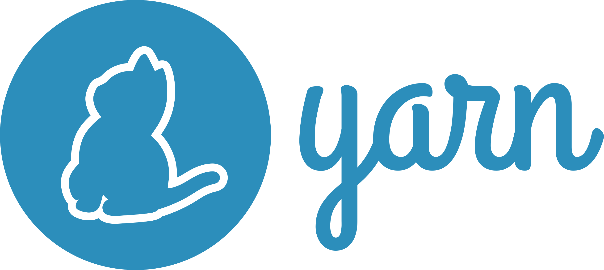
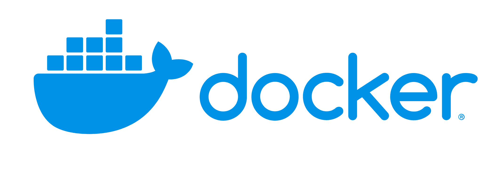

<h1 align="center">Hello, welcome to the repository for 42lwatch (V3)</h1>

This project aims to make accessible and gather data from 42 that are not easily visible or dispatched at multiple places but are easily visible from the API. (ex. have you ever wondered where are all the campuses and what's their coalitions are ?)

<h3 align="center">The code is open source, so feel free to leave a pull request on the project if you see any upgrade you want to see</h3>

## Stack
Interessed in the stack that make the website ? See for yourself

<h5>Frontend</h5>

  
  
  
  
  

 

<h5>Backend</h5>

  
  
  
  

 

<h5>Intrastructure</h5>

  
  
  
  

 

## Contributing

If you want to contribute to the project, I invite you to read the file [CONTRIBUTING.md](CONTRIBUTING.md) to know how to contribute to the project.

## Contact

If you want to contact me directly, you can do it on the 42Lausanne discord jjaqueme.

